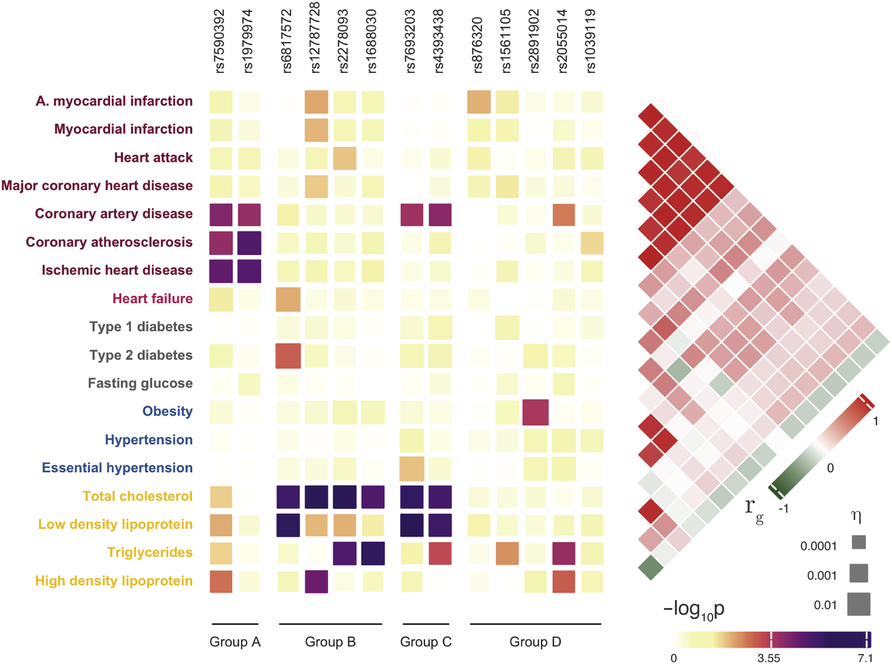
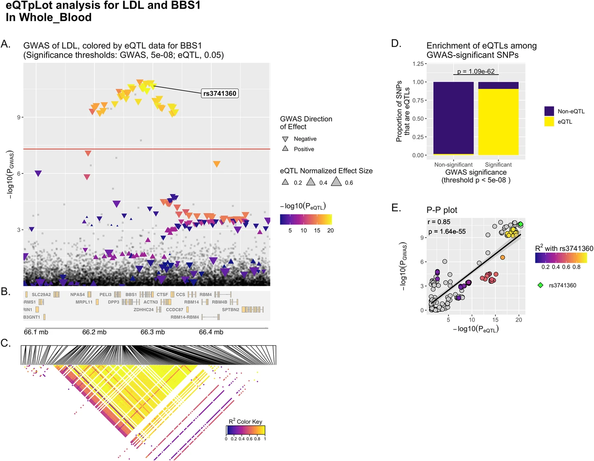

## PENGUIN: Progressively Establish Novel Genetics Underlying Interrelation
 

## 1. Download & Run

> 1. Download executables for [Linux](https://drive.google.com/file/d/1zvgbGQJfpPJK3mL748cYrv83HgryEo-x/view?usp=sharing), [Mac OS](https://drive.google.com/file/d/18Pqs_NMOq5uXZunFSv2un72Tw3I5wyxX/view?usp=sharing)
> 3. For Mac-OS: follow the instruction to install [Homebrew](https://raw.githubusercontent.com/Homebrew/install/HEAD/install.sh) and then run "[brew](https://brew.sh/) install zbar llvm", to install necessary libraries, and then double click "PENGUIN".
> - For Linux: run "sudo apt-get install libzbar0 python3-pyqt5" to install packages, then run PAGEANT by typing "./PENGUIN".
> - For advanced users, please check out the wiki for command line approaches.
 

## 2. Example test run 

> Once the GUI window is displayed, a user simply needs to click the “Analyze” button to do a “test-drive” without doing anything else.
> Once a user gets familiar with the test-drive, he/she could change all parameters in the GUI interface:
> > - sample name
> > - genotype data (in VCF format)
> > - configuration file
> > - output location for the genetic report and log file

 

## 3. Example report 

> - #### A full example genetic report can be viewed [here](https://pageant.me/Report.html). 

> - #### C1 (Crossing): cross GWAS QC (comparing EAF and BETA), and cross-trait meta-analyses.

> > - 

> - #### C2 (Correlation): using methods such as LDSC to calculate genetic correlation.

> > - 

> - #### C3 (Causation): using Mendelian Randomization to assess causality

> > - 

> - #### C4 (Colocalization): for pleiotropic loci of interest, finding causal variants and mechanisms

> > - 

> - #### C5: Collaboration: finding common pathways and networks, implicating potential drug targets

> > - 

 

### Contact & Cite

> - [Jie Huang](jiehuang001@pku.edu.cn) MD MPH PhD, Department of Global Health, Peking University School of Public Health
> - Manuscript under review
