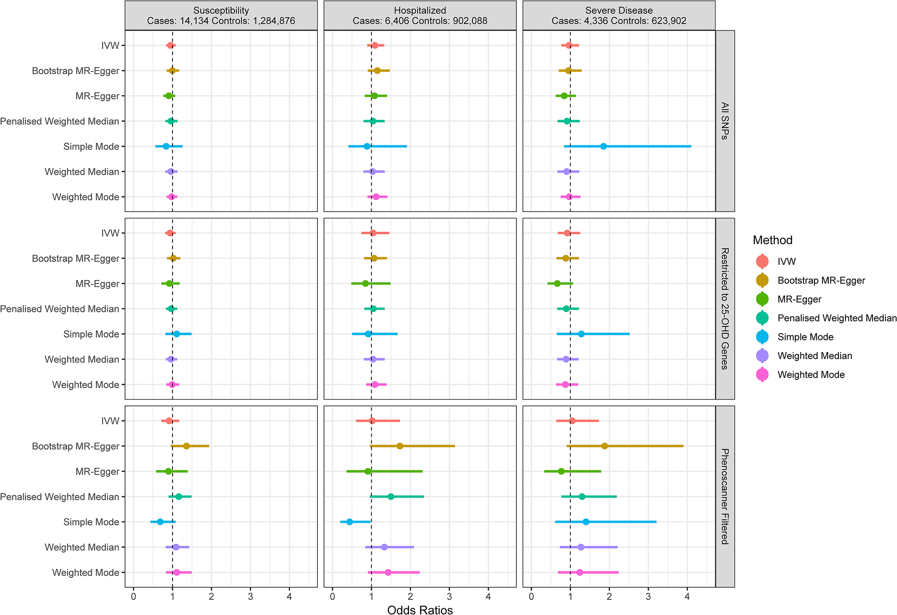

## PENGUIN: Practical Examining of maNy GWAS to Uncover Interactions and Networks  
 

> ## There days, there are too many GWAS dataset published, with or without publications. There are also quite many software and tools to analyze GWAS. However, there is a lack of user-friendly platform to analyze many GWAS in a systematic framework.  
> ## The five C of PENGUIN:
> - ## Crossing: cross GWAS QC (comparing EAF and BETA), and cross-trait meta-analyses.
> - ## Correlation: using methods such as LDSC to calculate genetic correlation.
> - ## Causation: using Mendelian Randomization to assess causality. 
> - ## Colocalization: for pleiotropic loci of interest, finding causal variants and mechanisms.  
> - ## Connection: finding common pathways and networks, implicating potential drug targets.   

    

## 1. Crossing example output

  

## 2. Correlation example output 

  

## 3. Causation example output

  

## 4. Colocalization example output

  

## 5. Connection example output

  
